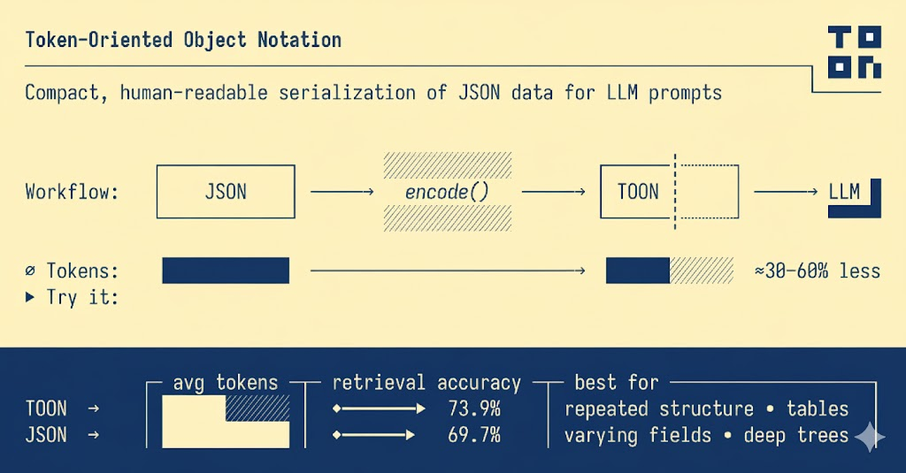

# toonX



**Dart implementation of TOON (Token-Oriented Object Notation)** - a compact, human-readable format for LLMs that uses **~40% fewer tokens than JSON** while maintaining **better accuracy**.

---

## 🎯 What is TOON?

TOON combines YAML's indentation-based structure with CSV-style tabular arrays to create the most efficient format for passing structured data to Large Language Models. It's a **lossless, drop-in replacement for JSON** designed specifically for LLM inputs.

**Think:** JSON for machines, TOON for AI models.

---

## 📦 What This Package Supports

**Core Functionality:**

-   ✅ **`encode()`** - Convert Dart objects to TOON format
-   ✅ **`decode()`** - Parse TOON strings back to Dart objects
-   ✅ **Lossless round-trip** conversion with full JSON data model support

**Encoding Options:**

-   ✅ **Custom delimiters** - comma (`,`), tab (`\t`), or pipe (`|`) for arrays
-   ✅ **Length markers** - optional `#` prefix for array validation (e.g., `tags[#3]`)
-   ✅ **Custom indentation** - configurable spaces per level (default: 2)
-   ✅ **Tabular arrays** - automatic CSV-style format for uniform objects
-   ✅ **Flat map mode** - flatten nested structures with custom separators
-   ✅ **Smart quoting** - minimal quoting, only when necessary

**Decoding Options:**

-   ✅ **Strict mode** - validates array lengths, delimiters, and syntax (default)
-   ✅ **Lenient mode** - best-effort parsing for malformed input
-   ✅ **Unflatten support** - reconstruct nested structures from flat maps
-   ✅ **Escape sequence handling** - proper handling of special characters

**Additional Features:**

-   ✅ **CLI tool** - command-line interface for file/stream conversion
-   ✅ **Comprehensive tests** - 46+ tests including large datasets
-   ✅ **Full documentation** - detailed API docs for all functions
-   ✅ **Type-safe** - strongly typed Dart implementation

---

## 💡 Why TOON?

### Token Efficiency

TOON significantly reduces token usage compared to other formats:

| Format         | Tokens    | vs TOON      |
| -------------- | --------- | ------------ |
| **TOON**       | **2,744** | **baseline** |
| JSON (compact) | 3,081     | +12%         |
| YAML           | 3,719     | +36%         |
| JSON           | 4,545     | +66%         |
| XML            | 5,167     | +88%         |

### LLM Accuracy

Benchmark results across 4 models on 209 data retrieval questions:

-   **TOON**: 73.9% accuracy
-   **JSON**: 69.7% accuracy
-   **YAML**: 69.0% accuracy
-   **XML**: 67.1% accuracy

**Result:** TOON achieves higher accuracy while using fewer tokens.

---

## 🚀 Quick Start

### Installation

```yaml
dependencies:
    toonx: ^1.0.0
```

### Basic Usage

```dart
import 'package:toonx/toonx.dart';

final data = {
  'users': [
    {'id': 1, 'name': 'Alice', 'role': 'admin'},
    {'id': 2, 'name': 'Bob', 'role': 'user'},
  ]
};

// Encode to TOON
final toon = encode(data);
print(toon);
// users[2]{id,name,role}:
//   1,Alice,admin
//   2,Bob,user

// Decode back to Dart
final decoded = decode(toon);
print(decoded); // Original data restored
```

---

## 💡 Why TOON?

### Token Efficiency

TOON significantly reduces token usage compared to other formats:

| Format         | Tokens    | vs TOON      |
| -------------- | --------- | ------------ |
| **TOON**       | **2,744** | **baseline** |
| JSON (compact) | 3,081     | +12%         |
| YAML           | 3,719     | +36%         |
| JSON           | 4,545     | +66%         |
| XML            | 5,167     | +88%         |

### LLM Accuracy

Benchmark results across 4 models on 209 data retrieval questions:

-   **TOON**: 73.9% accuracy
-   **JSON**: 69.7% accuracy
-   **YAML**: 69.0% accuracy
-   **XML**: 67.1% accuracy

**Result:** TOON achieves higher accuracy while using fewer tokens.

---

## 🎨 Advanced Features

### Custom Delimiters

Use tabs or pipes for maximum efficiency:

```dart
// Tab delimiter - best for token efficiency
encode(data, options: EncodeOptions(delimiter: '\t'));

// Pipe delimiter - human-readable
encode(data, options: EncodeOptions(delimiter: '|'));
```

### Flat Map

Flatten deeply nested structures:

```dart
final config = {
  'database': {'connection': {'host': 'localhost', 'port': 5432}}
};

// Flatten
final flat = encode(
  config,
  options: EncodeOptions(enforceFlatMap: true, flatMapSeparator: '.'),
);
// database.connection.host: localhost
// database.connection.port: 5432

// Unflatten on decode
final restored = decode(
  flat,
  options: DecodeOptions(enforceFlatMap: true, flatMapSeparator: '.'),
);
```

### Strict vs Lenient Parsing

```dart
// Strict mode (default) - validates array lengths and structure
decode(toon, options: DecodeOptions(strict: true));

// Lenient mode - best-effort parsing
decode(toon, options: DecodeOptions(strict: false));
```

### Length Markers

Explicit array size validation:

```dart
encode(data, options: EncodeOptions(lengthMarker: '#'));
// tags[#3]: admin,ops,dev
```

---

## 🔧 CLI Tool

Encode and decode via command line:

```bash
# Encode JSON to TOON
dart run toonx encode input.json -o output.toon

# Decode TOON to JSON
dart run toonx decode data.toon -o output.json

# Pipe from stdin
cat data.json | dart run toonx encode

# Show help
dart run toonx --help
```

---

## 📚 When to Use TOON

**Perfect for:**

-   ✅ Uniform arrays of objects (e-commerce orders, user records, logs)
-   ✅ LLM prompts with structured data
-   ✅ API responses for AI models
-   ✅ Time-series data and analytics
-   ✅ Configuration files for AI systems

**Consider alternatives:**

-   ❌ Deeply nested, non-uniform structures (JSON may be better)
-   ❌ Pure tabular data (CSV is smaller but less structured)
-   ❌ Binary data or extremely large payloads

---

## 📖 Examples

See comprehensive examples in [`example/example.dart`](example/example.dart):

1. Basic encoding and decoding
2. Tabular arrays for uniform data
3. Custom delimiters (tab, pipe)
4. Length markers
5. Flat map for nested structures
6. Strict vs lenient parsing
7. Real-world e-commerce example

---

## 🧪 Benchmarks

This package includes extensive tests with real-world data:

-   100+ employee records
-   E-commerce orders with nested structures
-   GitHub repositories data
-   Analytics time-series
-   Configuration files

Run tests: `dart test`

---

## 📄 Specification

This implementation follows the [TOON Specification v2.0](https://github.com/toon-format/toon) for cross-language compatibility.

---

## 🤝 Contributing

Contributions welcome! Please check the [official TOON repository](https://github.com/toon-format/toon) for the full specification and conformance tests.

---

## 📜 License

MIT License - see [LICENSE](LICENSE) file for details.

---

## 🔗 Links

-   [GitHub Repository](https://github.com/TheNoumanDev/toonX)
-   [pub.dev Package](https://pub.dev/packages/toonx)
-   [API Documentation](https://pub.dev/documentation/toonx/latest/)
-   [Issue Tracker](https://github.com/TheNoumanDev/toonX/issues)
-   [TOON Official Specification](https://github.com/toon-format/toon)
-   [Benchmarks & Accuracy Tests](https://github.com/toon-format/toon#benchmarks)
-   [Interactive Playground](https://toon.run)

---

**Made with ❤️ for the Dart & Flutter community**
